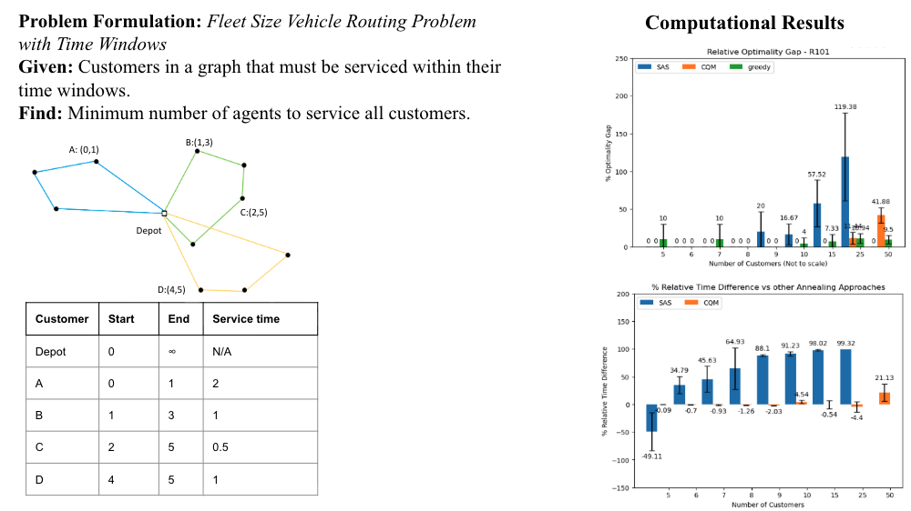
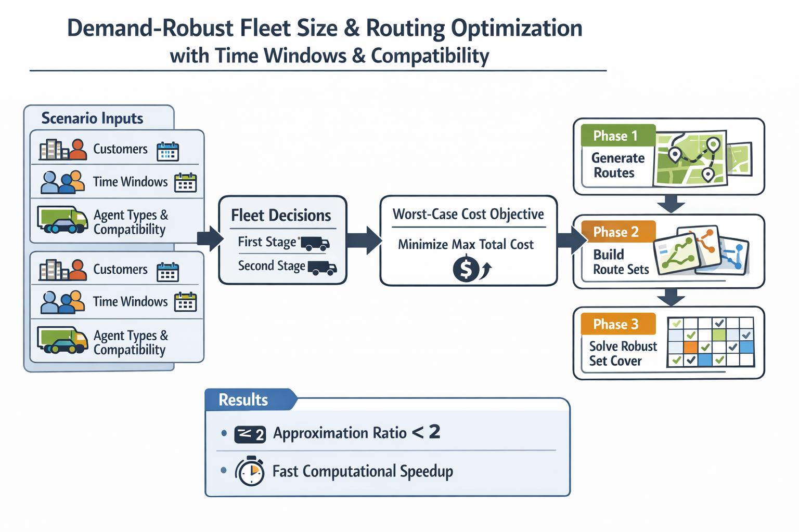

# Projects

[Home](/) · [Projects](/projects.html) · [Experience](/experience.html) · [Education](/education.html)

---

## A Greedy Quantum Route-Generation Algorithm for Vehicle Routing

Greedy, noise-robust QAOA variant for constrained vehicle routing problems that
exploits correlations between sampled bitstrings to guide route construction.

- Designed a noise-robust QAOA for constrained optimization problems which
  exploits correlation between samples, and provably converges to a feasible
  solution without post-processing.
- Showed the proposed algorithm obtains an ~80% lower optimality gap, in
  comparable time to state-of-the-art classical and quantum-inspired methods.
- Obtained computational results for graph instances up to 50 nodes using
  Qiskit and C++ on a high-performance computing cluster to deliver software
  artifacts for PWICE stakeholders (see Publications).

**Paper:** [arXiv:2405.03054](https://arxiv.org/abs/2405.03054)  
**Code:** [GitHub repo](https://github.com/makansij/A_Greedy_Quantum_Route-Generation_Algorithm)

**Presentation Slides:** [Project presentation](https://docs.google.com/presentation/d/1YIK_EFunaypRktvgGYcguHoCJ38KloZCanklNHuY_QQ)

**Conference Poster (PDF):** [Download](Conference_Poster.pdf)
---

## A Set Cover Mapping Heuristic for Demand-Robust Fleet Size VRP

Multi-year research effort on a practical, constrained optimization problem:
the demand-robust fleet size vehicle routing problem with time windows and
compatibility constraints. Combines robust optimization, set cover, and
large-scale computational experiments.

- Successfully executed a multi-year research project from grant-writing
  through state-of-the-art classical and quantum solution methods for practical
  constrained optimization problems, resulting in papers in both classical and
  quantum computing.
- Developed a novel classical algorithm for a demand-robust fleet size vehicle
  routing problem by mapping the problem to set cover in polynomial time.
- Validated performance on Solomon benchmark instances with up to 100 nodes,
  implemented using Pyomo and NumPy.
- Achieved ≥50% speedup over Gurobi with tuned parameters on all tested
  instance types with >25 nodes, while maintaining an empirical approximation
  ratio < 2.0 and a provable exponential asymptotic scaling advantage (see
  Publications).

**Paper:** [arXiv:2406.07719](https://arxiv.org/abs/2406.07719)  
**Code:** [GitHub repo](https://github.com/makansij/A_Set_Cover_Mapping_Heuristic_for_Demand-Robust_Fleet_Size_Vehicle_Routing_Problem)
